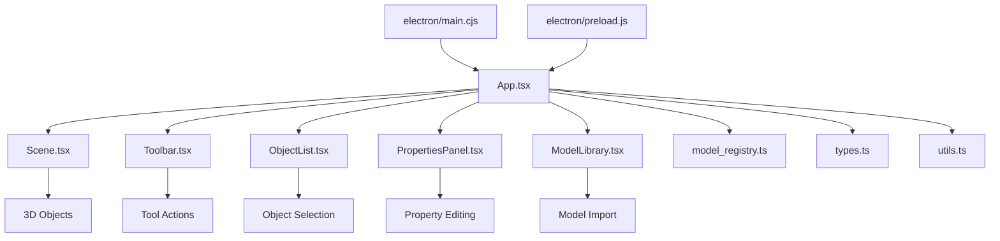

# StringLightCAD 3D 建模工具

**StringLightCAD** 是一个基于 Web 和 Electron 的轻量级 3D CAD 建模应用程序。它使用 React、Three.js (@react-three/fiber) 构建，支持作为网页运行，也可以打包为独立的 Windows 桌面软件 (.exe)。

本项目支持基础几何体创建、参数化编辑、布尔运算（合并/切割）、STL 模型导入导出以及基于工作平面的装配功能。

---

## 🚀 快速开始

### 1. 环境准备
确保您的电脑上已安装 **Node.js** (推荐 v16 或更高版本)。

### 2. 安装依赖
本项目不再依赖在线 CDN 加载核心库，请务必在根目录下运行以下命令下载本地依赖：

```bash
npm install
```

### 3. 运行开发环境

#### 🌐 Web 网页模式
仅启动网页服务：
```bash
npm run dev
```
访问控制台显示的地址（通常是 `http://localhost:3000`）。

#### 🖥️ 桌面软件模式 (Electron)
同时启动 React 服务和 Electron 窗口，实时预览桌面版效果：
```bash
npm run electron:dev
```

---

## 📦 打包桌面应用 (Windows EXE)

要将项目打包成独立的 Windows 可执行文件（无需安装浏览器即可运行）：

1.  运行构建命令：
    ```bash
    npm run electron:build
    ```

2.  构建完成后，查看项目根目录下的 **`release`** 文件夹：
    *   `win-unpacked/StringLightCAD.exe`: 免安装版，直接点击运行。
    *   `StringLightCAD Setup 1.0.0.exe`: 安装包文件。

---

## ⚠️ 离线运行说明

本项目已配置为从本地 `node_modules` 加载 React、Three.js 等核心逻辑库，因此核心建模功能可以在**无网络**环境下正常运行。

**关于样式和图标：**
目前的版本为了保持轻量，UI 样式库 (Tailwind CSS) 和图标库 (FontAwesome) 仍通过 `index.html` 中的 CDN 链接引入。
*   如果在**完全断网**的电脑上运行，软件功能可用，但 UI 可能会失去样式或图标显示为方块。
*   **完全离线解决方案**：请下载 Tailwind CSS 文件和 FontAwesome 字体包放置于 `public` 目录，并修改 `index.html` 中的引用路径指向本地文件。

---

## ❓ 常见问题 (Troubleshooting)

### 🔴 Error: Electron failed to install correctly
如果您在运行 `npm run electron:dev` 时遇到此错误，通常是因为网络原因导致 Electron 二进制文件无法下载。

**解决方法：**

1.  本项目已添加 `.npmrc` 文件，配置了国内镜像源。
2.  请先**删除**项目根目录下的 `node_modules` 文件夹。
3.  重新运行安装命令：
    ```bash
    npm install
    ```
4.  再次尝试启动。

---

## 📖 使用指南

### 1. 视图操作 (鼠标控制)
*   **旋转视角**：按住 **鼠标左键** 拖动。
*   **平移视角**：按住 **鼠标右键** 拖动。
*   **缩放视角**：滚动 **鼠标滚轮**。
*   **选中物体**：点击场景中的物体（选中后高亮显示）。
*   **多选**：按住 `Ctrl` 或 `Command` 键点击物体。
*   **取消选择**：点击背景空白处。

### 2. 界面布局
*   **左侧面板**：对象列表（支持滚轮快速切换模型库预览）。
*   **右侧面板**：属性编辑（支持修改位置、尺寸、颜色）。
*   **顶部工具栏**：包含变换工具、布尔运算、文件导入导出等。
*   **侧边栏收起**：点击面板标题旁的箭头可收起侧边栏，扩大绘图区域。

### 3. 核心功能

#### 📐 参数化编辑
选中物体后，在右侧面板修改参数。支持"等比例缩放"锁定。

#### 🔗 布尔运算 (合并/切割)
1.  选中主物体。
2.  点击 **切割** 或 **合并**。
3.  点击第二个物体即可生成结果。

#### 🛠️ 工作平面 (Work Plane)
1.  点击 **工作平面** 按钮。
2.  选择一个平面作为基准。
3.  选择另一个物体自动对齐，或直接在平面上创建新物体。

#### 📂 模型库
*   将 STL 文件放入 `src/models` (需配置) 或手动点击"打开模型文件夹"加载本地 STL。
*   在左侧列表滚动鼠标滚轮可快速浏览模型，点击导入。

---

## 🗂️ 项目结构详解

```
stringlightCAD/
├── components/                     # React 组件目录
│   ├── ModelLibrary.tsx           # 模型库组件，用于浏览和导入 STL 模型
│   ├── ObjectList.tsx             # 对象列表组件，显示场景中所有对象
│   ├── PropertiesPanel.tsx        # 属性面板组件，编辑选中对象的属性
│   ├── Scene.tsx                  # 3D 场景渲染组件，使用 react-three/fiber
│   ├── TestScene.tsx              # 测试场景组件（未使用）
│   └── Toolbar.tsx                # 工具栏组件，包含所有操作按钮
├── electron/                      # Electron 相关文件
│   ├── main.cjs                   # Electron 主进程文件，控制窗口和应用生命周期
│   └── preload.js                 # Electron 预加载脚本，建立主进程与渲染进程通信
├── src/                           # 源代码目录
│   ├── models/                    # STL 模型文件存放目录（需要手动创建）
├── App.tsx                        # 主应用组件，协调各组件状态和功能
├── index.html                     # HTML 入口文件
├── index.tsx                      # React 应用挂载点
├── metadata.json                  # 元数据文件（未使用）
├── model_registry.ts              # 模型注册表，自动扫描 models 目录中的 STL 文件
├── types.ts                       # TypeScript 类型定义文件
├── utils.ts                       # 工具函数文件
├── vite.config.ts                 # Vite 构建配置文件
├── package.json                   # 项目配置和依赖声明文件
├── tsconfig.json                  # TypeScript 配置文件
├── .gitignore                     # Git 忽略文件配置
├── .npmrc                         # NPM 配置文件（指定镜像源）
└── README.md                      # 项目说明文档

dist/                              # 构建输出目录
release/                           # Electron 打包输出目录
node_modules/                      # 依赖包目录
```

### 核心组件关系图



### 各文件详细说明

#### App.tsx - 主应用组件
这是整个应用的核心组件，负责协调各个子组件的状态管理和功能实现。它包含了：
- 对象管理状态（添加、删除、选择等）
- 布尔运算逻辑处理
- 历史记录和撤销功能
- 工作平面状态管理
- 文件导入/导出功能
- 与 Electron 主进程的通信

#### components/Scene.tsx - 3D 场景组件
负责 3D 场景的渲染和交互，使用 react-three/fiber 和 react-three/drei 库：
- 渲染所有 3D 对象
- 处理对象选择和变换操作
- 显示工作平面和辅助网格
- 实现对象变换控制（移动、旋转、缩放）

#### components/Toolbar.tsx - 工具栏组件
提供用户操作界面，包含所有功能按钮：
- 对象创建按钮（立方体、球体等）
- 变换工具（移动、旋转、缩放）
- 布尔运算按钮（合并、切割）
- 文件操作（导入、导出、保存、加载）
- 工作平面和模型库按钮

#### components/ObjectList.tsx - 对象列表组件
显示场景中所有对象的列表：
- 对象名称和类型显示
- 对象选择功能
- 多选支持

#### components/PropertiesPanel.tsx - 属性面板组件
编辑选中对象的各种属性：
- 对象名称、位置、旋转、缩放
- 几何参数（根据对象类型不同而变化）
- 颜色选择
- 等比例缩放锁定

#### components/ModelLibrary.tsx - 模型库组件
浏览和导入 STL 模型：
- 自动扫描 models 目录中的 STL 文件
- 支持手动选择文件夹导入模型
- 3D 预览功能

#### electron/main.cjs - Electron 主进程
控制桌面应用的窗口和生命周期：
- 创建和管理应用窗口
- 处理窗口关闭事件（检查未保存更改）
- 与渲染进程通信

#### electron/preload.js - Electron 预加载脚本
建立主进程与渲染进程的安全通信桥梁：
- 暴露有限的 API 给渲染进程
- 处理未保存更改检查的通信

#### model_registry.ts - 模型注册表
自动扫描和注册 models 目录中的 STL 文件：
- 使用 Vite 的 import.meta.glob 功能
- 生成模型列表供 ModelLibrary 组件使用

#### types.ts - 类型定义
定义项目中使用的 TypeScript 类型：
- CADObject 接口（表示 3D 对象）
- ShapeType 类型（对象类型枚举）
- WorkPlaneState 接口（工作平面状态）

#### utils.ts - 工具函数
包含各种辅助函数：
- 几何体创建函数
- 对象操作辅助函数

---

## 🧩 技术栈

- **前端框架**: React 19 + TypeScript
- **3D 引擎**: Three.js + @react-three/fiber + @react-three/drei
- **布尔运算**: three-bvh-csg
- **构建工具**: Vite
- **桌面应用**: Electron
- **包管理**: npm
- **STL 处理**: three/examples/jsm/loaders/STLLoader
- **UI 框架**: Tailwind CSS (CDN)
- **图标库**: Font Awesome (CDN)